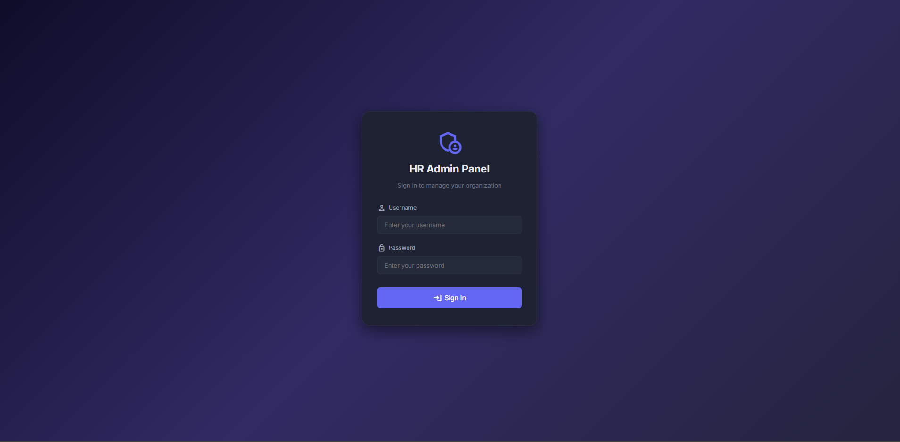
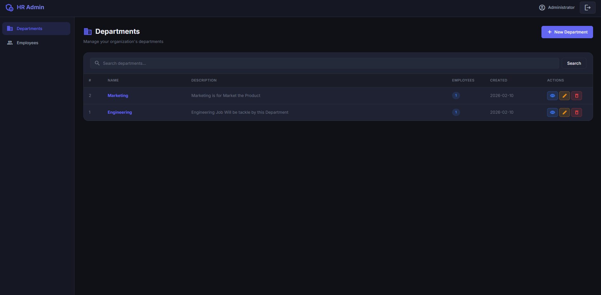
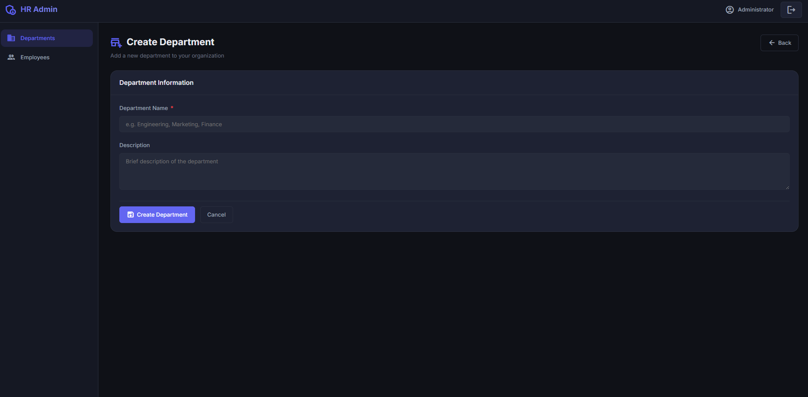
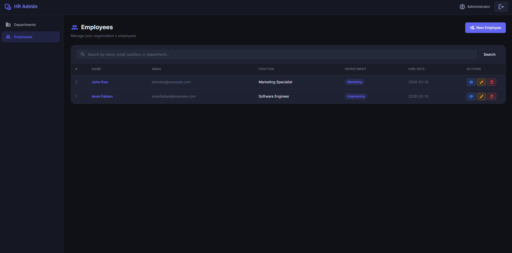
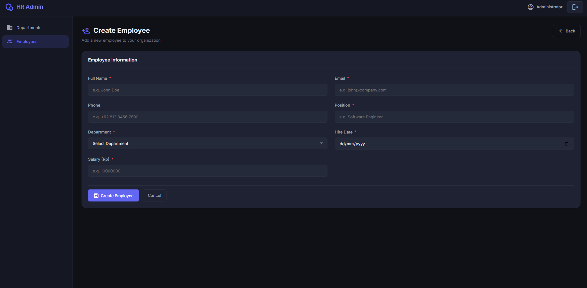

# HR Admin Panel - NestJS Fullstack Application

## 📋 Project Description

A fullstack admin panel for managing HR data (Departments and Employees) built with **NestJS** (TypeScript) following the **MVC (Model-View-Controller)** pattern. This application provides complete CRUD operations, authentication, search functionality, and paginated data display.

### Key Features
- **Authentication**: Secure login/logout with session-based authentication and bcrypt password hashing
- **Department Management**: Full CRUD operations for departments
- **Employee Management**: Full CRUD operations for employees linked to departments
- **Search**: Search functionality across all list pages
- **Pagination**: All list responses are paginated
- **Error Handling**: Global exception filter with custom error pages (404, 500)
- **Responsive Design**: Premium dark-themed UI that works on desktop and mobile

---

## 📸 Screenshots

| Page | Screenshot |
|------|------------|
| **Login / Landing Page** |  |
| **Department List** |  |
| **Department CRUD** |  |
| **Employee List** |  |
| **Employee CRUD** |  |

## 🗄️ Database Design

### Entity Relationship Diagram

[Open Entity Relationship Diagram](docs/project-diagrams.drawio)

*Note: Open this file with the Draw.io Integration extension in VS Code.*

### Tables

| Table | Description |
|-------|-------------|
| `users` | Admin users for authentication |
| `departments` | Organization departments |
| `employees` | Employees belonging to departments |

### Relationship
- **One-to-Many**: One Department has many Employees
- An Employee belongs to exactly one Department
- Deleting a Department cascades to delete all its Employees

---

## 🏗️ MVC Pattern Implementation

| Layer | Implementation | Files |
|-------|---------------|-------|
| **Model** | TypeORM Entities | `src/*/entities/*.entity.ts` |
| **View** | Handlebars Templates | `views/**/*.hbs` |
| **Controller** | NestJS Controllers | `src/*/*.controller.ts` |

### Architecture Diagram

[Open Architecture Diagram](docs/project-diagrams.drawio)

*Note: Open this file with the Draw.io Integration extension in VS Code.*

---

## 📦 Dependencies

### Production
| Package | Version | Description |
|---------|---------|-------------|
| `@nestjs/core` | ^11.0.0 | NestJS framework core |
| `@nestjs/typeorm` | latest | TypeORM integration for NestJS |
| `typeorm` | ^0.3.x | ORM for TypeScript/JavaScript |
| `pg` | ^8.x | PostgreSQL client for Node.js |
| `hbs` | ^4.x | Handlebars view engine for Express |
| `express-session` | ^1.x | Session middleware |
| `bcrypt` | ^5.x | Password hashing |
| `class-validator` | ^0.14.x | Validation decorators |
| `class-transformer` | ^0.5.x | Object transformation |
| `method-override` | ^3.x | HTTP method override (PUT/DELETE in forms) |

### Development
| Package | Description |
|---------|-------------|
| `typescript` | TypeScript compiler |
| `@nestjs/cli` | NestJS CLI tools |
| `@types/*` | TypeScript type definitions |

---

## 🚀 Getting Started

### Prerequisites
- **Node.js** >= 18.x
- **npm** >= 9.x
- **PostgreSQL** >= 14.x

### Installation

1. **Clone the repository**
   ```bash
   git clone <repository-url>
   cd Technical-Test-DOT-Indonesia
   ```

2. **Install dependencies**
   ```bash
   npm install
   ```

3. **Create PostgreSQL database**
   ```bash
   psql -U postgres -c "CREATE DATABASE dot_admin_panel;"
   ```

4. **Configure database** (if needed)
   
   Edit `src/app.module.ts` and update the database connection:
   ```typescript
   TypeOrmModule.forRoot({
     type: 'postgres',
     host: 'localhost',
     port: 5432,
     username: 'postgres',
     password: 'your_password',
     database: 'dot_admin_panel',
   })
   ```

5. **Run the application**
   ```bash
   # Development mode (with hot-reload)
   npm run start:dev

   # Production mode
   npm run build
   npm run start:prod
   ```

6. **Access the application**
   
   Open `http://localhost:3000` in your browser.

### Default Admin Credentials
- **Username**: `admin`
- **Password**: `admin123`

> The admin user is automatically created on first startup.

---

## 📁 Project Structure

```
src/
├── main.ts                          # Application entry point
├── app.module.ts                    # Root module
├── app.controller.ts                # Root controller (redirect)
├── common/
│   ├── filters/
│   │   └── http-exception.filter.ts # Global error handler
│   └── guards/
│       └── auth.guard.ts            # Authentication guard
├── auth/
│   ├── auth.module.ts
│   ├── auth.controller.ts           # Login/Logout (Controller)
│   ├── auth.service.ts              # Auth logic + user seeding
│   └── entities/
│       └── user.entity.ts           # User model (Model)
├── department/
│   ├── department.module.ts
│   ├── department.controller.ts     # Department CRUD (Controller)
│   ├── department.service.ts        # Business logic
│   └── entities/
│       └── department.entity.ts     # Department model (Model)
└── employee/
    ├── employee.module.ts
    ├── employee.controller.ts       # Employee CRUD (Controller)
    ├── employee.service.ts          # Business logic
    └── entities/
        └── employee.entity.ts       # Employee model (Model)

views/                               # Handlebars templates (View)
├── layouts/main.hbs                 # Main layout
├── partials/                        # Reusable components
├── auth/login.hbs                   # Login page
├── department/                      # Department pages
├── employee/                        # Employee pages
└── errors/                          # Error pages (404, 500)

public/                              # Static assets
├── css/style.css
└── js/app.js
```

---

## 🔧 API Endpoints

### Authentication
| Method | URL | Description |
|--------|-----|-------------|
| GET | `/auth/login` | Login page |
| POST | `/auth/login` | Process login |
| GET | `/auth/logout` | Logout |

### Departments
| Method | URL | Description |
|--------|-----|-------------|
| GET | `/departments` | List all (paginated) |
| GET | `/departments/create` | Create form |
| POST | `/departments` | Store new department |
| GET | `/departments/:id` | View detail |
| GET | `/departments/:id/edit` | Edit form |
| PUT | `/departments/:id` | Update department |
| DELETE | `/departments/:id` | Delete department |

### Employees
| Method | URL | Description |
|--------|-----|-------------|
| GET | `/employees` | List all (paginated) |
| GET | `/employees/create` | Create form |
| POST | `/employees` | Store new employee |
| GET | `/employees/:id` | View detail |
| GET | `/employees/:id/edit` | Edit form |
| PUT | `/employees/:id` | Update employee |
| DELETE | `/employees/:id` | Delete employee |

### Query Parameters
- `?page=1` - Page number for pagination
- `?search=keyword` - Search filter

---

## ⚠️ Error Handling

The application implements comprehensive error handling:

1. **Global Exception Filter** (`HttpExceptionFilter`)
   - Catches all unhandled exceptions
   - Returns JSON for API requests (`Accept: application/json`)
   - Renders error pages for browser requests
   - Logs errors with timestamps

2. **Validation**
   - Server-side form validation with descriptive error messages
   - Flash messages for user feedback

3. **Custom Error Pages**
   - 404 - Page Not Found
   - 500 - Internal Server Error

---

## 📝 Notes for Next Developer

- Database schema is auto-synced via TypeORM's `synchronize: true` (disable in production)
- Session secret should be moved to environment variables for production
- The admin user seed runs on every application startup (skips if already exists)
- All routes except `/auth/login` are protected by `AuthGuard`
- PUT/DELETE requests from HTML forms use `method-override` with `?_method=PUT|DELETE`
